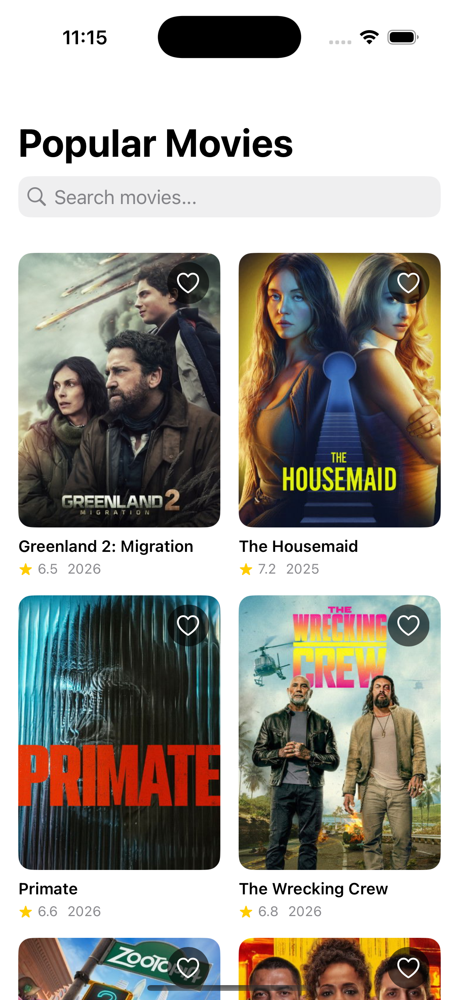
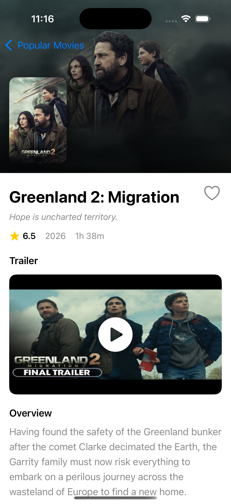

# MovieDB - iOS TMDb Movie App

A modern iOS application that integrates with The Movie Database (TMDb) API to display popular movies, search functionality, detailed movie information with trailers, and favorites management.

## 📱 Features

### ✅ Implemented Features

1. **Movies List Page (Home)**
   - Display popular movies in a grid layout
   - Each movie shows:
     - Movie poster
     - Title
     - Rating (with star icon)
     - Release year
     - Favorite toggle button
   - Pull-to-refresh to reload popular movies
   - Smooth scrolling with lazy loading

2. **Search Functionality**
   - Integrated search bar at the top
   - Real-time search with 500ms debouncing
   - Search movies by title
   - Clear indication when no results are found
   - Automatic return to popular movies when search is cleared

3. **Movie Detail Page**
   - **Video Player**: YouTube trailer integration with thumbnail and play button
   - **Complete Movie Information**:
     - Title and tagline
     - Rating (with star indicator)
     - Release year
     - Runtime (formatted as "Xh Ym")
     - Plot/Overview
     - Genres (horizontally scrollable chips)
     - Directors (with profile pictures)
     - Cast (first 10 actors with profile pictures and character names)
   - Backdrop image with gradient overlay
   - Favorite toggle button
   - Only displays **official YouTube trailers**

4. **Favorites**
   - Mark/unmark favorites from both list and detail pages
   - Heart icon indicator (filled red for favorites, outlined for non-favorites)
   - Persistent storage using UserDefaults
   - Favorites restore on app relaunch
   - Visual indication on movie cards

## 🏗️ Architecture

### MVVM (Model-View-ViewModel)

The app follows a clean MVVM architecture with clear separation of concerns:

```
MovieDB/
├── App/
│   └── MovieDBApp.swift          # App entry point
├── Models/                        # Data models
│   ├── Movie.swift                # Movie list model
│   ├── MovieDetail.swift          # Detailed movie model
│   ├── Video.swift                # Trailer/video model
│   └── Credits.swift              # Cast & crew models
├── Views/                         # SwiftUI views
│   ├── MoviesListView.swift       # Home screen
│   ├── MovieDetailView.swift     # Detail screen
│   ├── Components/
│   │   ├── MovieCardView.swift   # Movie card component
│   │   └── YouTubePlayerView.swift # In-app video player
│   └── ContentView.swift         # Root view
├── ViewModels/                    # Business logic
│   ├── MoviesViewModel.swift      # Home screen logic
│   └── MovieDetailViewModel.swift # Detail screen logic
├── Services/                      # Network layer
│   ├── NetworkService.swift       # Protocol + implementation
│   └── TMDbAPI.swift             # API endpoints
├── Managers/                      # Utilities
│   └── FavoritesManager.swift    # Favorites persistence
└── Utilities/                     # Helpers
    ├── Constants.swift            # API keys & URLs
    └── Extensions.swift           # Helper extensions
```

## 🔧 Setup Instructions

### Prerequisites

- **Xcode**: Version 15.0 or later
- **iOS**: Deployment target iOS 16.0 or later
- **Swift**: Version 5.9 or later

### Installation Steps

1. **Clone the Repository**
   ```bash
   git clone <repository-url>
   cd iOS-MovieDB/MovieDB
   ```

2. **Install Dependencies**
   
   The project uses **Kingfisher** via Swift Package Manager (already configured):
   - Open the project in Xcode
   - Xcode will automatically resolve the package
   - If needed, go to File → Packages → Resolve Package Versions

3. **API Key Configuration**
   
   The API key is already configured in the project:
   - Location: `MovieDB/Utilities/Constants.swift`
   - Current API Key: `f54170f2cadd41837b91ba1c67099283`
   
   If you need to change it:
   ```swift
   struct Constants {
       static let apiKey = "YOUR_API_KEY_HERE"
   }
   ```

4. **Open the Project**
   ```bash
   open MovieDB.xcodeproj
   ```

5. **Build and Run**
   - Select your target device or simulator
   - Press `Cmd + R` to build and run
   - Kingfisher will be automatically linked

## 🚀 Dependencies

This project uses **Kingfisher** for efficient image loading and caching, plus native iOS frameworks:
- **Kingfisher**: High-performance async image downloading and caching
- **SwiftUI**: Modern declarative UI framework
- **Combine**: Reactive programming for search debouncing
- **URLSession**: Async/await networking
- **UserDefaults**: Local persistence for favorites
- **Foundation**: Core utilities

## 🎯 Key Technical Decisions

### 1. **Protocol-Based Network Layer**
   - `NetworkServiceProtocol` allows for easy mocking and testing
   - Generic `fetch<T: Decodable>` method for type-safe API calls
   - Comprehensive error handling with custom `NetworkError` enum

### 2. **Async/Await Throughout**
   - All network calls use modern async/await syntax
   - Clean, readable asynchronous code
   - Proper error propagation and handling

### 3. **Favorites Management**
   - Singleton pattern for global access
   - `@Published` property for reactive UI updates
   - UserDefaults for simple, effective persistence
   - Set<Int> for efficient favorite lookups

### 4. **Search Debouncing**
   - Combine framework for 500ms debouncing
   - Prevents excessive API calls while typing
   - Automatic cancellation of previous searches

### 5. **Parallel Data Loading**
   - Uses `TaskGroup` to fetch movie details, videos, and credits concurrently
   - Faster load times for detail screen
   - Graceful handling of partial failures

### 6. **Trailer Filtering**
   - Only shows official YouTube trailers
   - Filters by: `site == "YouTube"`, `type == "Trailer"`, `official == true`
   - Takes the first matching trailer

### 7. **Cast & Crew Display**
   - Shows top 10 cast members (by order)
   - Filters crew to show directors only
   - Profile pictures with fallback to placeholder icon

### 8. **Image Loading & Caching (Kingfisher)**
   - High-performance async image loading
   - Automatic memory and disk caching
   - Smooth scrolling with lazy loading
   - Placeholder images during load
   - Graceful error handling
   - Optimized for performance and battery life

## 📝 Assumptions

1. **Internet Connection Required**: App requires active internet connection for all features
2. **Network Access**: If using Jio network, VPN may be required as TMDb is blocked on Jio
3. **Trailers**: Most movies have YouTube trailers; when unavailable, section is hidden
4. **Runtime Data**: Popular movies endpoint doesn't include runtime; fetched from details API
5. **Image Quality**: Uses w500 for posters, w780 for backdrops, w185 for profiles
6. **Cast Limit**: Shows first 10 cast members to maintain performance
7. **Local Favorites Only**: Favorites are stored locally; no cloud sync
8. **English Content**: API returns English content by default
9. **TMDb API Stability**: Assumes TMDb API structure remains consistent

## ✨ Implemented Features Detail

### Movies List Page
- ✅ Grid layout with 2 columns
- ✅ Movie poster images with async loading
- ✅ Title (2 lines max)
- ✅ Rating with star icon
- ✅ Release year
- ✅ Favorite heart button on each card
- ✅ Pull-to-refresh
- ✅ Loading indicators
- ✅ Error handling with retry

### Search
- ✅ Search bar integrated in navigation
- ✅ Real-time search with debouncing
- ✅ Clear search functionality
- ✅ Empty state handling
- ✅ Search results in same grid layout

### Movie Detail Page
- ✅ Backdrop image with gradient
- ✅ Poster thumbnail
- ✅ Title and tagline
- ✅ Rating, year, and runtime
- ✅ Favorite toggle button
- ✅ YouTube trailer player (opens in YouTube app/web)
- ✅ Plot/overview
- ✅ Genres (scrollable chips)
- ✅ Directors with profile pictures
- ✅ Cast with profile pictures and character names
- ✅ Smooth scrolling
- ✅ Loading and error states

### Favorites
- ✅ Add/remove from list view
- ✅ Add/remove from detail view
- ✅ Visual indication (filled heart)
- ✅ Persistent across app launches
- ✅ Instant UI updates via Combine

## 🐛 Known Limitations

1. **No Offline Support**: Requires internet connection; no caching implemented
2. **No Pagination**: Only loads first page of popular movies and search results
3. **No Favorites Screen**: Favorites are only indicated on cards and detail page; no dedicated screen to view all favorites together
4. **Basic Error Messages**: Generic error messages without detailed troubleshooting
5. **No Share Functionality**: Cannot share movies with others
6. **No Deep Linking**: No support for opening specific movies via URL
7. **No Accessibility Labels**: VoiceOver support not fully implemented
8. **No Landscape Optimization**: UI optimized for portrait mode only
9. **No Unit Tests**: While code is structured for testability, no tests are included

## 🧪 Testing Approach (for future implementation)

The code is structured to be testable:

```swift
// Example: Mock network service
class MockNetworkService: NetworkServiceProtocol {
    func fetch<T: Decodable>(from endpoint: String, queryItems: [URLQueryItem]?) async throws -> T {
        // Return mock data
    }
}

// Example: Test ViewModel
let mockService = MockNetworkService()
let viewModel = MoviesViewModel(tmdbService: TMDbService(networkService: mockService))
```

## 📸 Screenshots

### Home Screen (Movies List)



### Movie Detail Screen


## 🔗 API Endpoints Used

1. **Popular Movies**: `/movie/popular`
2. **Search Movies**: `/search/movie?query={QUERY}`
3. **Movie Details**: `/movie/{movie_id}`
4. **Movie Videos**: `/movie/{movie_id}/videos`
5. **Movie Credits**: `/movie/{movie_id}/credits`

## 👨‍💻 Development Notes

- **SwiftUI**: Fully native SwiftUI implementation
- **iOS 16+**: Uses latest SwiftUI features (searchable, refreshable, task)
- **Dark Mode**: Full dark mode support
- **Type Safety**: Leverages Swift's type system with Codable
- **Memory Management**: Proper use of weak self in closures
- **Code Organization**: Clear separation of concerns

## 📄 License

This project is for assessment purposes.

---

**Built with ❤️ using SwiftUI**
